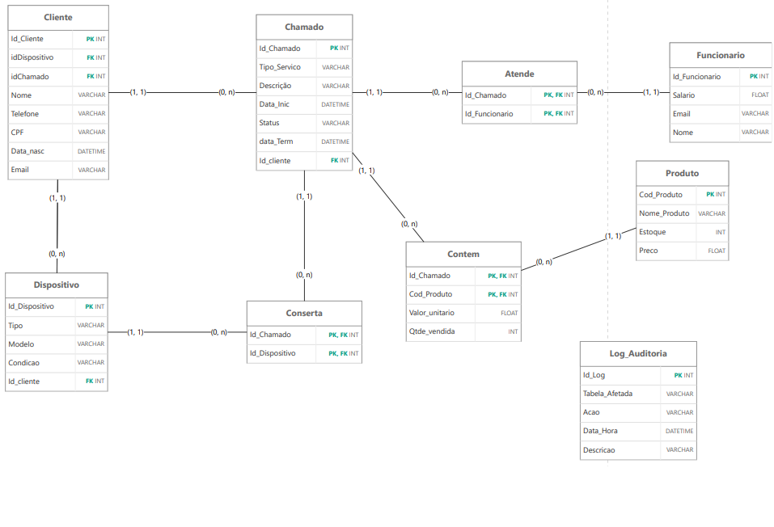

# Sistema de Gestão de Assistência Técnica 💻🔧
**Projeto de Banco de Dados Relacional - IFSP Birigui**

---

### 👥 Equipe Desenvolvedora (Integrantes):

Caio Corrêa Santos  

Gabriel Cintra Rodrigues Montresol

Heitor Camilo

Tainá Reis Oliveira

---

## 📌 Sobre o Projeto
Este projeto consiste no desenvolvimento e implementação de um banco de dados relacional para um **Sistema de Gestão de Assistência Técnica e Vendas de Eletrônicos**. O problema central que buscamos resolver é a desorganização comum em lojas de manutenção, onde há dificuldade em rastrear de forma unificada os clientes, o estado de entrada dos seus dispositivos, o estoque de peças e os técnicos responsáveis por cada conserto.

## 🛠️ O que Optamos Fazer
Para construir uma solução robusta e realista, optamos por estruturar o sistema em torno da entidade **Chamado**, que centraliza toda a operação da loja. Essa escolha nos permitiu unificar tanto os serviços de "Conserto" quanto os de "Venda" direta em um único fluxo de negócio.

Decidimos modelar o banco de dados no Oracle contendo 8 tabelas altamente normalizadas. Para garantir a integridade e a automação do sistema sem depender exclusivamente de uma aplicação externa, optamos por implementar regras de negócio diretamente no banco de dados. 

Utilizamos **Triggers** para realizar a baixa automática de estoque a cada peça vendida e para registrar logs de auditoria sempre que o status de um serviço é alterado. Além disso, criamos uma **Stored Procedure** com cursores e controle de transações (Commit/Rollback) para garantir o encerramento seguro dos chamados e o cálculo financeiro preciso das operações.

---

# 📊 Documento do Projeto
Abaixo está o documento do projeto.

[📄 Clique aqui para abrir/baixar o Documento do Projeto (PDF)](ProjetoFinal.pdf)

[📄 Visualização do Projeto Final](projeto_final.png)

---

## 🗄️ Modelo Lógico / Diagrama Entidade-Relacionamento (DER)
Abaixo apresentamos a modelagem física do banco de dados, detalhando as 8 tabelas criadas, suas chaves primárias (PK), chaves estrangeiras (FK) e os relacionamentos de cardinalidade estabelecidos para suportar as regras de negócio.

